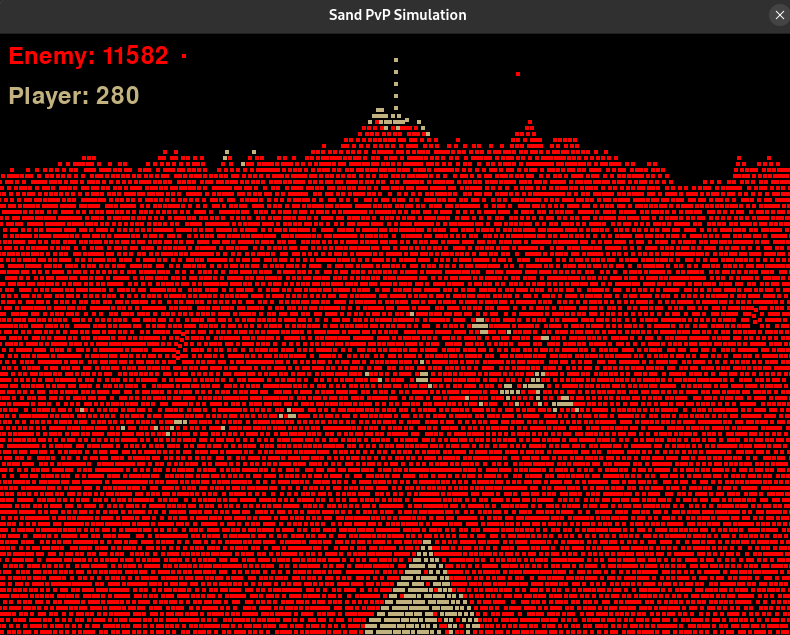

# Sand Particle Simulation

A Python-based interactive sand particle simulation using Pygame. This project creates a realistic sand-falling animation where particles interact with each other and form natural-looking piles.





## Features

- Interactive particle creation on mouse click
- Realistic particle physics
- Start menu with Play button
- Natural sand pile formation
- Smooth particle movement and collision detection

## Requirements

- Python 3.x
- Pygame

## Installation

1. Clone the repository:
```bash
git clone https://github.com/yourusername/sand-simulation.git
cd sand-simulation
```

2. Install dependencies:
```bash
pip install pygame
```

## Usage

Run the simulation:
```bash
python sand_simulation.py
```

- Click the "Play" button to start
- Click anywhere on the screen to drop sand particles
- Watch as particles fall and form natural piles
- Close window to exit

## How It Works

The simulation uses a particle-based system where each sand grain:
- Falls due to gravity
- Detects collisions with other particles
- Slides diagonally when blocked
- Forms realistic pile patterns

## Project Structure

```
sand-simulation/
│
├── sand_simulation.py   # Main simulation code
└── README.md           # This file
```

## Contributing

1. Fork the repository
2. Create a feature branch
3. Commit your changes
4. Push to the branch
5. Open a Pull Request

## License

This project is licensed under the MIT License - see the LICENSE file for details.
